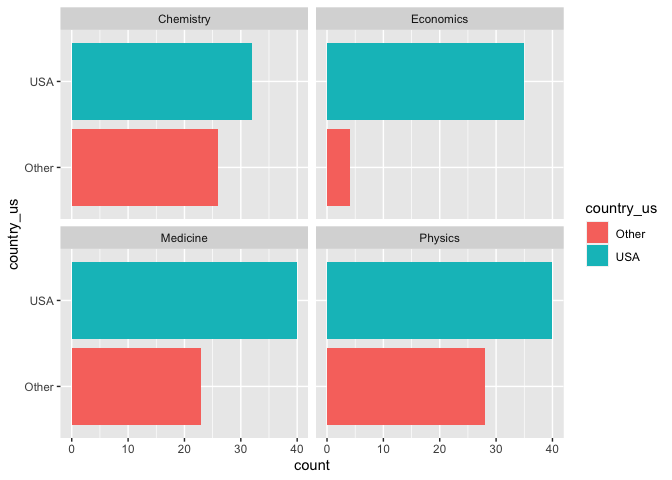

Lab 03 - Nobel laureates
================
Lindsey Wilson
01/26/2023

### Load packages and data

``` r
library(tidyverse) 
```

``` r
nobel <- read_csv("data/nobel.csv")
```

## Exercises

### Exercise 1

The `nobel` dataset has 935 observations and 26 variables:

``` r
# this gives the number of observations we have
nobel %>%
  summarize(n())
```

    ## # A tibble: 1 × 1
    ##   `n()`
    ##   <int>
    ## 1   935

``` r
#and this tells us the names/numbers of our variables
names(nobel)
```

    ##  [1] "id"                    "firstname"             "surname"              
    ##  [4] "year"                  "category"              "affiliation"          
    ##  [7] "city"                  "country"               "born_date"            
    ## [10] "died_date"             "gender"                "born_city"            
    ## [13] "born_country"          "born_country_code"     "died_city"            
    ## [16] "died_country"          "died_country_code"     "overall_motivation"   
    ## [19] "share"                 "motivation"            "born_country_original"
    ## [22] "born_city_original"    "died_country_original" "died_city_original"   
    ## [25] "city_original"         "country_original"

### Exercise 2

The code below creates a new data frame called `nobel_living` that
filters the `nobel` dataset for living people. If we did this rght, we
should be left with a 228 observations:

``` r
nobel_living <- nobel %>%
  filter(!is.na(country),
         gender != "org",
         is.na(died_date)
         )

count <- nobel_living %>%
  summarize(n())

message("the nobel_living dataset contains ", count, " observations")
```

    ## the nobel_living dataset contains 228 observations

### Exercise 3

Now we want to visualize how likely US vs. non-US scientists are to win
Nobel prizes in the sciences. To do this. we first have to add a
variable to the `nobel_living` data frame called `country_us`. This
variable takes the value of “USA” if the person is from the US, and
“Other” if not:

``` r
nobel_living <- nobel_living %>%
  mutate(
    country_us = if_else(country == "USA", "USA", "Other")
  )
```

Next we have to make a new data frame called `nobel_living_science` that
only considers prizes in physics, medicine, chemistry, and economics:

``` r
nobel_living_science <- nobel_living %>%
  filter(category %in% c("Physics", "Medicine", "Chemistry", "Economics"))
```

And finally, we can use this new data frame to make a visualization that
compares the number of Nobel laureates from each science category that
are US-based vs. non-US-based. From this we can see that US-based
researchers are much more likely to win Nobel prizes, especially in
economics.

``` r
ggplot(data = nobel_living_science,
       mapping = aes(x = country_us,
                     fill = country_us)) + 
  geom_histogram(stat = "count") +
  coord_flip() +
  facet_wrap( ~ category, ncol = 2)
```

    ## Warning in geom_histogram(stat = "count"): Ignoring unknown parameters:
    ## `binwidth`, `bins`, and `pad`

<!-- -->

### Exercise 4

So if being *based* in the US increases your chances of winning a Nobel
prize in the sciences, does it matter whether or not you were *born* in
the US? Let’s find out. Just like last time, we start by adding a
variable to `nobel_living_science` called `born_country_us`. This
variable takes the value of “USA” if the researcher was born in the US
and “Other” if not:

``` r
nobel_living_science <- nobel_living_science %>%
  mutate(
    born_country_us = if_else(born_country == "USA", "USA", "Other")
    )
```

As a fun aside, we can count how many individuals in our modified
dataset were born in the US:

``` r
born_US_count <- nobel_living_science %>%
  filter(born_country_us == "USA") %>%
  summarize(n())

message(born_US_count, " individuals in the the nobel_living_science dataset were born in the US")
```

    ## 105 individuals in the the nobel_living_science dataset were born in the US

### Exercise 5

Finally, we can adapt the code. from Ex. 3 to see how many of the
US/foreign based winners were born in the US vs. outside the US:

``` r
ggplot(data = nobel_living_science,
       mapping = aes(x = country_us,
                     fill = born_country_us)) + 
  geom_histogram(stat = "count") +
  coord_flip() +
  facet_wrap( ~ category, ncol = 2)
```

    ## Warning in geom_histogram(stat = "count"): Ignoring unknown parameters:
    ## `binwidth`, `bins`, and `pad`

<!-- -->

This allows us to see that, while a majority of the US-based winners in
the sciences were also US-born, a sizeable chunk were born outside the
US. Therefore, it looks like being *in* the US helps for winning a
prize, but being *from* the US isn’t as strong a predictor. This
supports the conclusions drawn by the Buzzfeed article, since the only
way you could be based in the US but not from there is if you
immigrated.

### Exercise 6

So, where are those immigrant Nobel laureates from? The code below
allows us to answer that question by filtering from
`nobel_living_sciences` those winners who were based in the US at the
time of their award but who were born outside of it. We can then
generate a frequency plot that tells us the names and counts of the
countries where these individuals were born:

``` r
born_country_counts <- nobel_living_science %>%
  filter(country_us == "USA",
         born_country_us == "Other") %>%
  count(born_country, sort = TRUE)

print(born_country_counts, n = 100)
```

    ## # A tibble: 21 × 2
    ##    born_country       n
    ##    <chr>          <int>
    ##  1 Germany            7
    ##  2 United Kingdom     7
    ##  3 China              5
    ##  4 Canada             4
    ##  5 Japan              3
    ##  6 Australia          2
    ##  7 Israel             2
    ##  8 Norway             2
    ##  9 Austria            1
    ## 10 Finland            1
    ## 11 France             1
    ## 12 Ireland            1
    ## 13 Italy              1
    ## 14 Lithuania          1
    ## 15 Mexico             1
    ## 16 Scotland           1
    ## 17 South Africa       1
    ## 18 Sweden             1
    ## 19 Taiwan             1
    ## 20 Turkey             1
    ## 21 Ukraine            1
