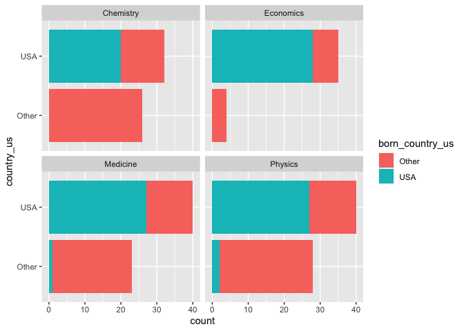

Lab 03 - Nobel laureates
================
Lindsey Wilson
01/26/2023

### Load packages and data

``` r
library(tidyverse) 
```

``` r
nobel <- read_csv("data/nobel.csv")
```

## Exercises

### Exercise 1

The `nobel` dataset has 935 observations and 26 variables:

``` r
# this gives the number of observations we have
nobel %>%
  summarize(n())
```

    ## # A tibble: 1 × 1
    ##   `n()`
    ##   <int>
    ## 1   935

``` r
#and this tells us the names/numbers of our variables
names(nobel)
```

    ##  [1] "id"                    "firstname"             "surname"              
    ##  [4] "year"                  "category"              "affiliation"          
    ##  [7] "city"                  "country"               "born_date"            
    ## [10] "died_date"             "gender"                "born_city"            
    ## [13] "born_country"          "born_country_code"     "died_city"            
    ## [16] "died_country"          "died_country_code"     "overall_motivation"   
    ## [19] "share"                 "motivation"            "born_country_original"
    ## [22] "born_city_original"    "died_country_original" "died_city_original"   
    ## [25] "city_original"         "country_original"

### Exercise 2

The code below creates a new data frame called `nobel_living` that
filters the `nobel` dataset for living people. If we did this rght, we
should be left with a 228 observations:

``` r
nobel_living <- nobel %>%
  filter(!is.na(country),
         gender != "org",
         is.na(died_date)
         )

count <- nobel_living %>%
  summarize(n())

message("the nobel_living dataset contains ", count, " observations")
```

    ## the nobel_living dataset contains 228 observations

### Exercise 3

Now we want to visualize how likely US vs. non-US scientists are to win
Nobel prizes in the sciences. To do this. we first have to add a
variable to the `nobel_living` data frame called `country_us`. This
variable takes the value of “USA” if the person is from the US, and
“Other” if not:

``` r
nobel_living <- nobel_living %>%
  mutate(
    country_us = if_else(country == "USA", "USA", "Other")
  )
```

Next we have to make a new data frame called `nobel_living_science` that
only considers prizes in physics, medicine, chemistry, and economics:

``` r
nobel_living_science <- nobel_living %>%
  filter(category %in% c("Physics", "Medicine", "Chemistry", "Economics"))
```

And finally, we can use this new data frame to make a visualization that
compares the number of Nobel laureates from each science category that
are US-based vs. non-US-based. From this we can see that US-based
researchers are much more likely to win Nobel prizes, especially in
economics.

``` r
ggplot(data = nobel_living_science,
       mapping = aes(x = country_us,
                     fill = country_us)) + 
  geom_histogram(stat = "count") +
  coord_flip() +
  facet_wrap( ~ category, ncol = 2)
```

    ## Warning in geom_histogram(stat = "count"): Ignoring unknown parameters:
    ## `binwidth`, `bins`, and `pad`

<!-- -->

### Exercise 4

So if being *based* in the US increases your chances of winning a Nobel
prize in the sciences, does it matter whether or not you were *born* in
the US? Let’s find out. Just like last time, we start by adding a
variable to `nobel_living_science` called `born_country_us`. This
variable takes the value of “USA” if the researcher was born in the US
and “Other” if not:

``` r
nobel_living_science <- nobel_living_science %>%
  mutate(
    born_country_us = if_else(born_country == "USA", "USA", "Other")
    )
```

As a fun aside, we can count how many individuals in our modified
dataset were born in the US:

``` r
born_US_count <- nobel_living_science %>%
  filter(born_country_us == "USA") %>%
  summarize(n())

message(born_US_count, " individuals in the the nobel_living_science dataset were born in the US")
```

    ## 105 individuals in the the nobel_living_science dataset were born in the US

Finally, we can adapt the code. from Ex. 3 to split things up by whether
or not the researcher was born in the US. When we do this, we get a
different picture than when we graph based on where the researcher is
based:

``` r
ggplot(data = nobel_living_science,
       mapping = aes(x = born_country_us,
                     fill = born_country_us)) + 
  geom_histogram(stat = "count") +
  coord_flip() +
  facet_wrap( ~ category, ncol = 2)
```

    ## Warning in geom_histogram(stat = "count"): Ignoring unknown parameters:
    ## `binwidth`, `bins`, and `pad`

<!-- -->

So it actually looks like being born in the US puts you at a slight
disadvantage for winning the Nobel in every category except economics.
Therefore, it looks like being *in* the US helps for winning a prize,
but being *from* the US generally doesn’t. This supports the conclusions
drawn by the Buzzfeed article, since the only way you could be based in
the US but not from there is if you immigrated.

### Exercise 4

…

### Exercise 5

…

### Exercise 6

…
